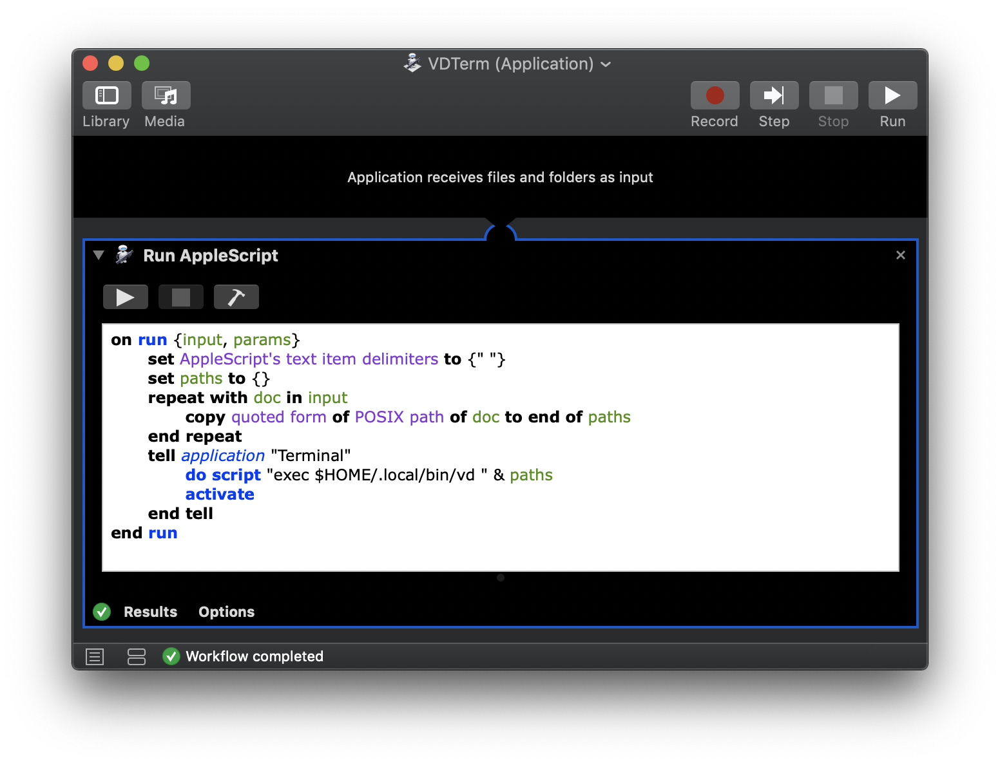
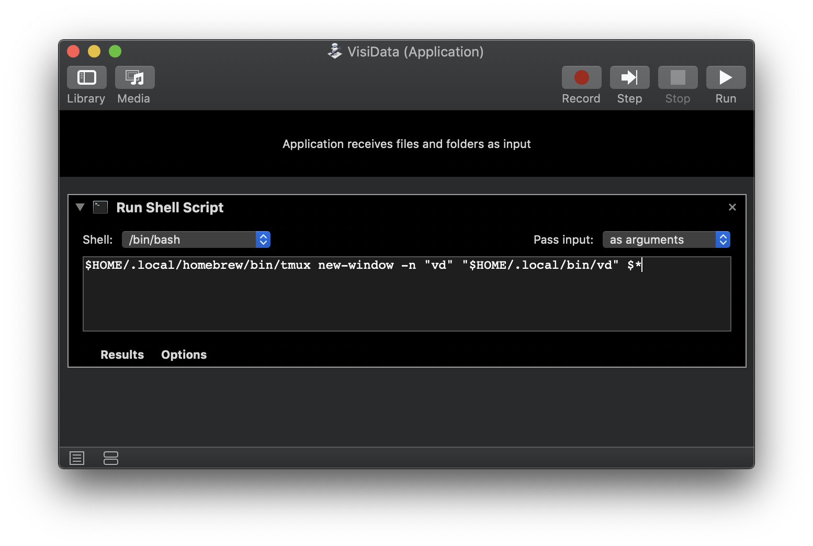

# Mac Automator Scripts

Separate from the work in [vd-dmg](vd-dmg.md), it's useful to have a thin Mac application bundle (.app) to wrap VisiData. That adds support for actions like dragging documents onto a VisiData icon, or setting VisiData as the default application for different file types.

One approach is using somethign like [PyInstaller](https://pythonhosted.org/PyInstaller/) to package up VisiData and create an application bundle at the same time. Another option is creating separate launcher applications with Automator. Since the Automator approach is decoupled from the VisiData install, applications created that way can through VisiData upgrades and changes. They also slot in nicely as a follow-up step to any existing VisiData installation methods (pip, pipx, brew, etc).

Here are a couple different script recipes that help add native Mac application functionality to an existing VisiData install. For the sake of these examples, the VisiData binary is symlinked to `$HOME/.local/bin/vd`.

### Launch VisiData in a New Terminal Window

These steps create an application named `VDTerm`. It can be used with multiple documents via drag-and-drop, the "Open With..." dialogue, etc. When it opens, it will:

* Launch the Terminal app if it isn't already running
* Open a new window
* Open all provided paths in a single VisiData session

To create the application:

* Launch `Automator`
* Create a New document of the `Application` type
* Add a `Run Applescript` task with the following code:

```applescript
on run {input, params}
	set AppleScript's text item delimiters to {" "}
	set paths to {}
	repeat with doc in input
		copy quoted form of POSIX path of doc to end of paths
	end repeat
	tell application "Terminal"
		do script "exec $HOME/.local/bin/vd " & paths
		activate
	end tell
end run
```

* Save the application to `~/Applications` with a name of your choice (`VDTerm` in this sample)



### Open a New Tmux Window

This one is more friendly to Tmux users who may use alternate terminal applications. It's a more straightforward script, because it doesn't need to worry about opening a terminal itself. It also makes a few simplifying assumptions, like:

* Tmux is installed at `$HOME/.local/homebrew/bin/tmux`
* The VisiData binary is available at `$HOME/.local/bin/vd`
* A Tmux session is currently running

This application is likely to need local tweaks. That said, to create it:

* Launch `Automator`
* Create a New document of the `Application` type
* Add a `Run Shell Script` task, with the following code (tweak paths as needed to match your environment):

```bash
$HOME/.local/homebrew/bin/tmux new-window -n "vd" "$HOME/.local/bin/vd" $*
```

*Note:* Be sure to choose `as arguments` in the `pass input` drop-down box as shown here:



* Save the application to `~/Applications` with a name of your choice (`VisiData` in this sample)
